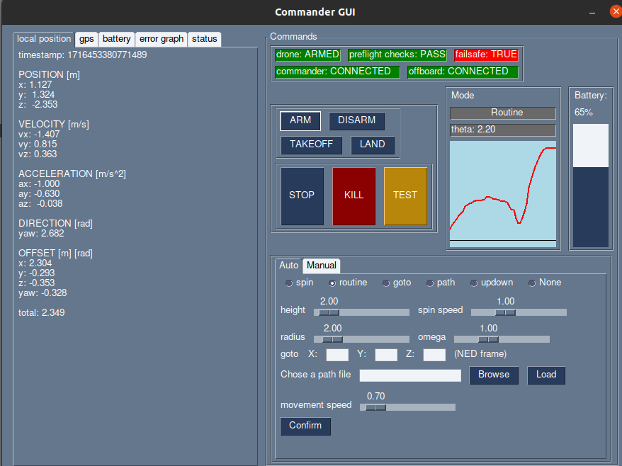
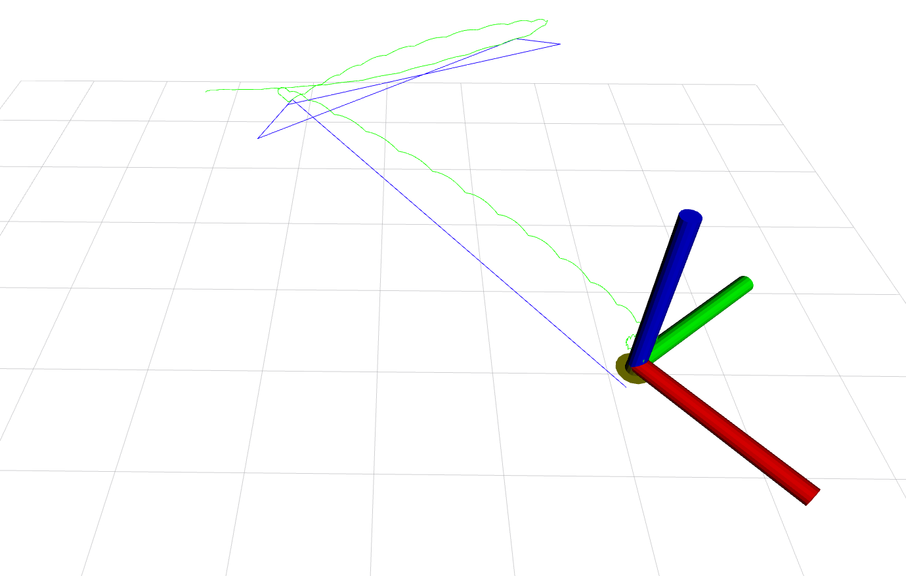
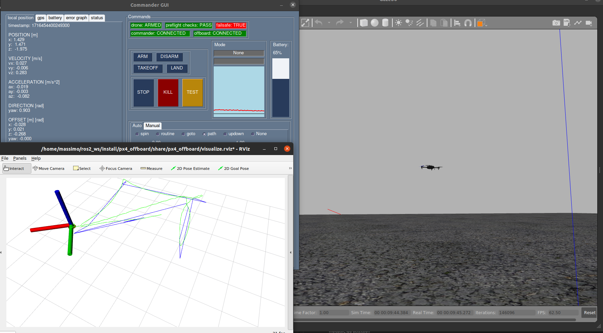

# px4-py

# Table of Contents

- [terminology](#terminology)
- [command and programs](#commands-and-programs)
  1. [px4-py](#px4-pypy)
  2. [gui](#guipy)
  3. [opti-to-px4.py](#opti-to-px4py)
  4. [opti](#opti)
  5. [rviz](#rviz)
  6. [Docker commander](#docker-commander)
  7. [Docker companion](#docker-companion)
  8. [QGroundControl](#QGroundControl)
- [Build instructions](#build-instructions)
- [Run instructions](#run-instructions)
- [additional resources](#additional-resources)

# terminology

- `commander` main computer wrom where the drone takes commands
- `companion` single board computer that interfaces direcly with the flight controller on the drone, is listening to the commander messages
- `optitrack` motion capture system, used to detect the drone position

# commands and programs

Used and edit the file `resource/.bash_aliases` to fit your system

### px4-py.py

Main process, recives all ross messages from gui and companion, elaborates information and published commands to the drone

### gui.py

Graphical interface, does not comunicate direcly with the companion.\
Displays information and relays commands to the commander



- `ARM` arms the drone if the above contitions are met
- `DISARM` disarms the drone before it takes off or when it landed, does not work mid flight
- `TAKEOFF` takes of to the height declared in `src/config.py` by the variable `takeoff_height`
- `LAND` lands at (0,0) local frame, position cannot be overriden
- `STOP` stops any activity and hold the position
- `TEST` button to test features, currently lands on a random position
- `KILL` emergency stop, terminates the flight immediately, enem mid air
- `SPIN` spin on self wit omega = spin speed slider
- `ROUTINE` starts hovering in circle around (0,0), at height = height , omega = omega slider,radius = radius
- `GOTO` goes to position x,y,z !!!in NED frame (up is negative height)
- `PATH` load a path file like src/medium.json and the drone fill follow all points with speed = moviment speed slider
- `UPDOWN` goes up and lands, mainly for testing
- `NONE` default, no activity, the drone will hover
- `GRAPH` shows arudimentary graph of position offset between the set position and the current position, gives a rough estimate of the offset

other commands and tabs are self explanatory

### opti-to-px4.py

Subscribes to the optitrack pose topic, converts the frame to NED and publishes it back

### opti

Alias for `TRACKED_ROBOT_ID=44 ros2 run optitrack_interface optitrack` , starts the optitrack client and published ROS2 pose messages, might need to change IP addersses int the code.
This code is used alongside with `opti-to-px4.py`
Alternatively use `TRACKED_ROBOT_ID=44 ros2 run optitrack_interface optitrack2` for an all in one solition of decoding optitrack messages and converting them into px4 messages.\
\
The `TRACKED_ROBOT_ID` tracked robot varable is used to chose the ID of the optitrack model without recompiling the code

### rviz

The command `r2path1000`, alias for `RVIZ_MAX_BUFFER=1000 ros2 launch px4_offboard visualize.launch.py` launches rviz with 2 poses, the big one is the pose of the drone, the small one is the pose from optitrack.\
`RVIZ_MAX_BUFFER=1000` sets the buffer to the latest 1000 messages recived, this prevents clogging of the iterface and slow down of the system, not setting the varable will keep the complete history



### Docker commander

`dockercommander` alias for `xhost + && docker run --rm -it --network host -e DISPLAY=:0 -v $HOME/shared:/root/shared -v /tmp/.X11-unix:/tmp/.X11-unix drone-commander:main-squash ; xhost -` launches the commander container with all programs and the gui should appear

### Docker companion

`dockerdrone` alias for `docker run -it --network host --device /dev/ttyS2 -v $HOME/shared:/root/shared drone-companion:main-squash`
launches the companion container with all programs

### QGroundControl

Application used to configure the flight controller

# build instructions

Always source ROS2 files (alias `s`)

## general setup

- Follow the instructions `Installation & Setup` at https://docs.px4.io/main/en/ros/ros2_comm.html#installation-setup
- clone the repositories in the ROS" `src` folder:
  ```
  git clone https://github.com/Massiccio1/px4-py.git
  git clone https://github.com/Massiccio1/optitrack_interface.git
  git clone https://github.com/Massiccio1/px4-offboard.git
  git clone https://github.com/PX4/px4_msgs.git
  git clone https://github.com/Massiccio1/commander_msg.git
  ```
- build for ROS2 with `colcon build --symlink-install --parallel-workers 8` or the alias `ccbsi`

## docker build

- clone the repo: `git clone https://github.com/Massiccio1/px4-22.git`

For all the buids you can use `--squash` is supported, this will reduce disk usage but you will lose the build cache

- build the core image: `cd core && docker build -t drone-core .`
- build the commander image: `cd commander-squashed && docker build -t drone-commander:main-squash .`
- build the commander image: `cd companion-squashed && docker build -t drone-companion:main-squash .`

to update an image to the iamges to the latest commit:

- `cd updatecommander && docker build -t drone-commander:main-squash --squash .`
- `cd updatecompanion && docker build -t drone-companion:main-squash --squash  .`

# run instructions

Always source ROS2 files (alias `s`)

## Commander

- `px4-py/src/px4-py.py` for the offboard controller
- `px4-py/src/px4-py.py` for the gui

## Companion

- `sudo MicroXRCEAgent serial --dev /dev/ttyS2 -b 921600` or the alias `agentreal` for the XRCE agent (edit /dev/tty based on your board)
- `TRACKED_ROBOT_ID=44 ros2 run optitrack_interface optitrack` or the alias `opti` for the optitrack client
- `px4-py/src/opti-to-px4.py` for converting pose messages to px4 messages
  - alternatively use `TRACKED_ROBOT_ID=44 ros2 run optitrack_interface optitrack2` instead of the prevuois 2 commands

## Docker

following the bash aliases, run

- `dockercommander` on the commander computer
- `dockerdrone` on the companion

# simulation

Follow the instructions at https://docs.px4.io/main/en/simulation/

For Ubuntu20 you can use `make px4_sitl gazebo-classic` in the PX4-Autopilot root folder to start the simulation, you can add the enviroment varable `HEADLESS=1` to make it headless without starting the gazebo graphical interface.

To enable the SITL (Software in the loop) you need to run `MicroXRCEAgent udp4 -p 8888` in the MicroXRCEAgent root folder or use the alias `agent`

Now you can start the `px4-py.py` process and eventually the gui



# additional resources

### custom flying parameters

Load the parameters in the `resource` folder into the flight controller using the QGroundControl application, these are set to use an external vision as position esimator, sets the optitrack sensor offset, baudrate on serial comunication, offboard behavior and more

### custom firmware

A custom firmware is used because it's more stable, the new one crashe frequently

- check out the repo to the commit `97191bd60f536b4add2e27e3b2124a375e465e17`
- edit `$HOME/PX4-Autopilot/src/modules/uxrce_dds_client/dds_topics.yaml` like the one in the `resource` folder, this will include the battery indicator, lad detection
- get the make command from https://docs.px4.io/main/en/dev_setup/building_px4.html#nuttx-pixhawk-based-boards and run it inside the PX4 folder, for my board it's `make px4_fmu-v6c_default`
- load the firmware from inside the QGroundControl application

### companion serial comunication

#todo add boot options to activate serial comunication into resource folder

## versions

if versions are incompatible with px4 message use the commit `97191bd60f536b4add2e27e3b2124a375e465e17` from the PX4-Autopilot repo, and copy the messages from there
